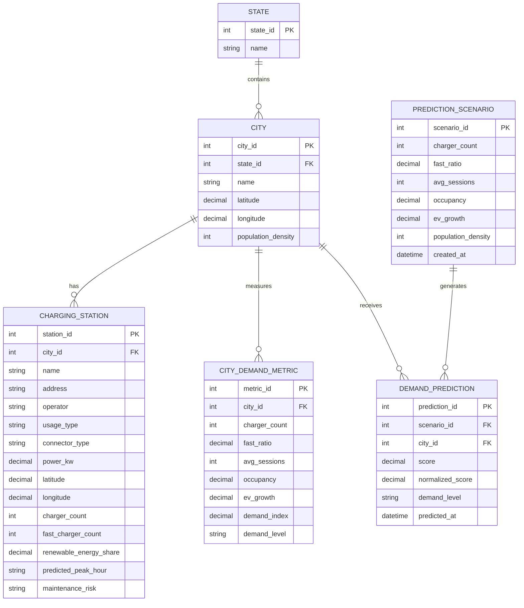

# EV Charging Demand System ER Diagram

This project currently uses CSV files and API data models rather than a relational database. The diagram below represents the entities implied by the datasets and prediction workflow, and can be used as a reference if the project is later moved to a database.

## Source Mapping

- `STATE`, `CITY`, and `CITY_DEMAND_METRIC` come from `backend/city_demand_index.csv`.
- `CHARGING_STATION` comes from `backend/data/Indian_EV_Stations_Simplified.csv` and `backend/data/Indian_EV_Stations_Simplified1.csv`.
- `PREDICTION_SCENARIO` maps to the FastAPI `InputData` request model in `backend/main.py`.
- `DEMAND_PREDICTION` maps to the `/predict` response generated in `backend/main.py`.

