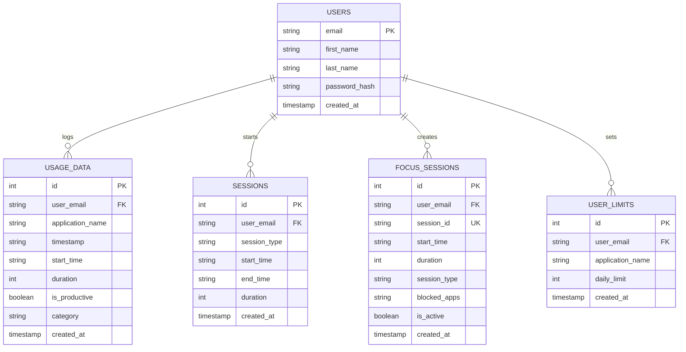
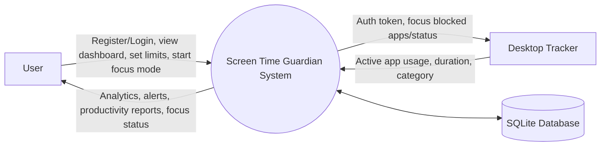
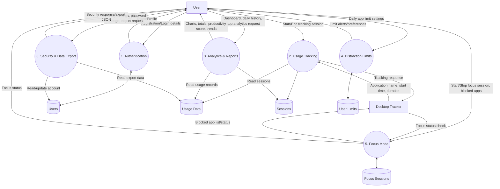
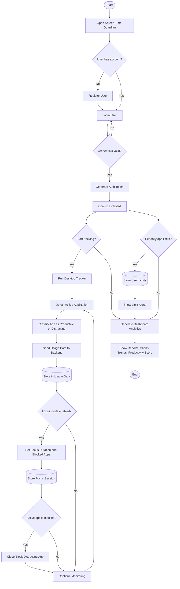

# Screen Time Guardian - ER Diagram and DFD

Based on `C:\Users\HP\Downloads\last_screen_time_guardian (1).zip`.

## ER Diagram

## DFD Level 0 - Context Diagram

## DFD Level 1 - Main Processes

## Main Data Flow Summary

1. User registers or logs in.
2. Backend stores user details in `users` and returns a simple bearer token.
3. Desktop tracker detects the active application.
4. Tracker sends app name, duration, timestamp, productivity flag, and category to the backend.
5. Backend stores this in `usage_data`.
6. Dashboard and analytics pages read `usage_data` to show totals, trends, top apps, productivity score, and reports.
7. User can set distraction limits in `user_limits`.
8. User can start focus mode, stored in `focus_sessions`.
9. Tracker checks focus status and blocks matching apps during an active focus session.

## SFD - System Flow Diagram

